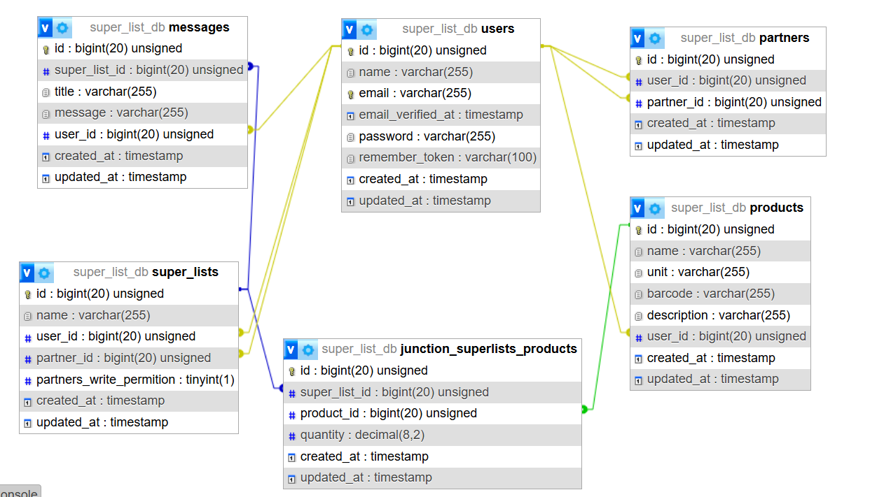

# Supermarket List API

A RESTful API built with Laravel for managing supermarket shopping lists. Users can create shopping lists, add products, share lists with others, and communicate via messages for clarifications.


## Features

- User authentication with Sanctum.
- Create, read, update, and delete shopping lists, products and messages.
- Share shopping lists with other users.
- Messaging functionality for list clarifications.
- RESTful design principles.

## Installation

  

### Prerequisites
- PHP 8.2 or higher
- Composer
- MySQL
- Laravel Framework 11.25.0

### Steps
1. Clone the repository:
```bash
git clone https://github.com/BluEDr/supermarket-list-api.git
```
2. Navigate to the project directory:
```bash
cd supermarket-list-api
```
3. Install dependencies:
```bash
composer install
```
4. Set up the .env file:
```bash
cp .env.example  .env
```

5. Configure database connection in the .env file:
```
DB_CONNECTION=mysql
DB_HOST=127.0.0.1
DB_PORT=3306
DB_DATABASE=super_list_db
DB_USERNAME=root
DB_PASSWORD=yourpassword
```
5. Run migrations:
```bash
php artisan migrate
```
6. Start the development server:
```bash
php artisan serve
```


## Database Schema
 



# API Documentation

- In the following documentation, I have included the example header value 6\|lilV61oUWSpNPJbDoLJH1l7BnK4pxIJrWVHxOyZl60df52f6. In your case, you first need to make an HTTP request to the /api/login endpoint to obtain an access token. Then, include this token in the header of every subsequent request you make.

### Register

* URL: /api/register
* Method: POST
* Request Body:
```JSON
{
    "name" : "Tryfon Skordos",
    "email" : "tryfon@skordos.gr",
    "password" : "password"
}
```
* Response:
```JSON
{
    "status": "User registered successfully"
}
```
### Login  

* URL: /api/login
* Method: POST
* Request Body:
```JSON
{
	"email": "your@email.com",
	"password": "password"
}
```
* Response:
```JSON
{
	"access_token": "6|lilV61oUWSpNPJbDoLJH1l7BnK4pxIJrWVHxOyZl60df52f6",
	"token_type": "Bearer"
}
```
### Logout  

* URL: /api/logout
* Method: POST
* Request Header:

|Key                            |Value                                                |
|-------------------------------|-----------------------------------------------------|
|`Authorization`                |`6\|lilV61oUWSpNPJbDoLJH1l7BnK4pxIJrWVHxOyZl60df52f6` |

* Response:
```JSON
{
    "message": "Logged out successfully"
}
```
### Add new partner  

* URL: /api/addNewPartner
* Method: POST
* Request Header:

|Key                            |Value                                                |
|-------------------------------|-----------------------------------------------------|
|`Authorization`                |`6\|lilV61oUWSpNPJbDoLJH1l7BnK4pxIJrWVHxOyZl60df52f6` |


* Request Body:
```JSON
{
    "partnersMail":"akis@skordos.com.gr"
}
```

* Response:
```JSON
{
    "status": "Success",
    "message": "You have successfully added a new partner!",
    "data": {
        "partnersName": "Akis Sk",
        "partnersMail": "akis@skordos.com.gr",
        "partnersCreatedAccount": "2024-12-28T08:01:53.000000Z"
    }
}
```

### Check partnership  

* URL: /api/checkPartnership
* Method: GET
* Request Header:

|Key                            |Value                                                |
|-------------------------------|-----------------------------------------------------|
|`Authorization`                |`6\|lilV61oUWSpNPJbDoLJH1l7BnK4pxIJrWVHxOyZl60df52f6` |


* Request Params:

|Key                            |Value                                                |
|-------------------------------|-----------------------------------------------------|
|`partnerMail`                  |`akis@skordos.com.gr`                                  |

* Response:
```JSON
{
    "status": "success",
    "partnersId": 6,
    "partnersMail": "akis@skordos.com.gr",
    "isPartner": true
}
```

### Delete partner

* URL: /api/deletePartner/{id}
* Method: DELETE
* Request Header:
  
|Key                            |Value                                                |
|-------------------------------|-----------------------------------------------------|
|`Authorization`                |`6\|lilV61oUWSpNPJbDoLJH1l7BnK4pxIJrWVHxOyZl60df52f6` |

* Response:
```JSON
{
    "status": "success",
    "message": "The partnership with this user has successfully deleted."
}
```

### Add new product  

* URL: /api/addNewProduct
* Method: POST
* Request Header:

|Key                            |Value                                                |
|-------------------------------|-----------------------------------------------------|
|`Authorization`                |`6\|lilV61oUWSpNPJbDoLJH1l7BnK4pxIJrWVHxOyZl60df52f6` |


* Request Body:
```JSON
{    
    "name" : "ΝΟΥΝΟΥ Kid Ρόφημα Γάλακτος Υψηλής Παστερίωσης Παιδικό από 2 Ετών",
    "unit" : "ml",
    "barcode" : "5206851242421"
}
```

* Response:
```JSON
{
    "status": "success",
    "message": "The product added succesfully."
}
```

### Delete a product

* URL: /api/deleteProduct/{id}
* Method: DELETE
* Request Header:
  
|Key                            |Value                                                |
|-------------------------------|-----------------------------------------------------|
|`Authorization`                |`6\|lilV61oUWSpNPJbDoLJH1l7BnK4pxIJrWVHxOyZl60df52f6` |

* Response:
```JSON
{
    "status": "success",
    "message": "You have successfully deleted the product."
}
```
### Update a product

* URL: /api/updateProduct/{id}
* Method: PUT
* Request Header:
  
|Key                            |Value                                                |
|-------------------------------|-----------------------------------------------------|
|`Authorization`                |`6\|lilV61oUWSpNPJbDoLJH1l7BnK4pxIJrWVHxOyZl60df52f6` |

* Request Body:
```JSON    
{
    "barcode" : 2565889,
    "name" : "pop corns",
    "unit" : "grams"
}
```

* Response:
```JSON
{
    "status": "success",
    "message": "You have successfully update a product",
    "data": {
        "id": 9,
        "name": "pop corns",
        "unit": "grams",
        "barcode": 2565889,
        "description": null,
        "user_id": 1,
        "created_at": "2024-12-29T07:46:29.000000Z",
        "updated_at": "2024-12-29T07:52:34.000000Z"
    }
}
```

### Get all products  

* URL: /api/getAllProducts
* Method: GET
* Request Header:

|Key                            |Value                                                |
|-------------------------------|-----------------------------------------------------|
|`Authorization`                |`6\|lilV61oUWSpNPJbDoLJH1l7BnK4pxIJrWVHxOyZl60df52f6` |


* Response:
```JSON
{
    "status": "success",
    "data": [
        {
            "id": 6,
            "name": "LURPAK Βούτυρο Ανάλατo 500gr",
            "unit": "gr",
            "barcode": "5740900837430",
            "description": "Ανάλατo",
            "user_id": 1,
            "created_at": "2024-11-29T11:07:26.000000Z",
            "updated_at": "2024-11-29T11:07:26.000000Z"
        },
        {
            "id": 8,
            "name": "ΝΟΥΝΟΥ Kid Ρόφημα Γάλακτος Υψηλής Παστερίωσης Παιδικό από 2 Ετών",
            "unit": "ml",
            "barcode": "5206851242421",
            "description": null,
            "user_id": 1,
            "created_at": "2024-12-29T07:43:42.000000Z",
            "updated_at": "2024-12-29T07:43:42.000000Z"
        },
        {
            "id": 9,
            "name": "pop corns",
            "unit": "grams",
            "barcode": "2565889",
            "description": null,
            "user_id": 1,
            "created_at": "2024-12-29T07:46:29.000000Z",
            "updated_at": "2024-12-29T07:52:34.000000Z"
        }
    ]
}
```
### Add new super market list  

* URL: /api/createANewSuperList
* Method: POST
* Request Header:

|Key                            |Value                                                |
|-------------------------------|-----------------------------------------------------|
|`Authorization`                |`6\|lilV61oUWSpNPJbDoLJH1l7BnK4pxIJrWVHxOyZl60df52f6` |


* Request Body:
```JSON
{
    "name": "Σκλαβενίτης",
    "partner_id":5,    
    "partners_write_permition":true
}
```

* Response:
```JSON
{
    "status": "success",
    "message": "The new super_list has succesfully created.",
    "data": {
        "name": "Σκλαβενίτης",
        "partner_id": 5,
        "partners_write_permition": true,
        "user_id": 1
    }
}
```
### Update a super market list

* URL: /api/updateSuperList/{id}
* Method: PUT
* Request Header:
  
|Key                            |Value                                                |
|-------------------------------|-----------------------------------------------------|
|`Authorization`                |`6\|lilV61oUWSpNPJbDoLJH1l7BnK4pxIJrWVHxOyZl60df52f6` |

* Request Body:
```JSON    
{
    "name" : "ΑΒ Βασιλόπουλος",
    "partners_write_permition" : false
}
```

* Response:
```JSON
{
    "status": "success",
    "message": "The entry has been successfully updated.",
    "data": {
        "id": 36,
        "name": "ΑΒ Βασιλόπουλος",
        "user_id": 1,
        "partner_id": 5,
        "partners_write_permition": false,
        "created_at": "2024-12-29T08:03:32.000000Z",
        "updated_at": "2024-12-29T08:06:40.000000Z"
    }
}
```
### Delete a super markt list

* URL: /api/deleteSuperList/{id}
* Method: DELETE
* Request Header:
  
|Key                            |Value                                                |
|-------------------------------|-----------------------------------------------------|
|`Authorization`                |`6\|lilV61oUWSpNPJbDoLJH1l7BnK4pxIJrWVHxOyZl60df52f6` |

* Response:
```JSON
{
    "status": "success",
    "message": "The super list has been successfully deleted."
}
```
### Add new product in a super market list  

* URL: /api/addNewProduct
* Method: POST
* Request Header:

|Key                            |Value                                                |
|-------------------------------|-----------------------------------------------------|
|`Authorization`                |`6\|lilV61oUWSpNPJbDoLJH1l7BnK4pxIJrWVHxOyZl60df52f6` |


* Request Body:
```JSON
{
    "superId":36,
    "productId":8
}
```

* Response:
```JSON
{
    "status": "success",
    "list": {
        "id": 36,
        "name": "ΑΒ Βασιλόπουλος",
        "user_id": 1,
        "partner_id": 5,
        "partners_write_permition": 0,
        "created_at": "2024-12-29T08:03:32.000000Z",
        "updated_at": "2024-12-29T08:06:40.000000Z"
    },
    "product": {
        "id": 8,
        "name": "ΝΟΥΝΟΥ Kid Ρόφημα Γάλακτος Υψηλής Παστερίωσης Παιδικό από 2 Ετών",
        "unit": "ml",
        "barcode": "5206851242421",
        "description": null,
        "user_id": 1,
        "created_at": "2024-12-29T07:43:42.000000Z",
        "updated_at": "2024-12-29T07:43:42.000000Z"
    }
}
```
### Get the products from a super market list

* URL: /api/checkPartnership
* Method: GET
* Request Header:

|Key                            |Value                                                |
|-------------------------------|-----------------------------------------------------|
|`Authorization`                |`6\|lilV61oUWSpNPJbDoLJH1l7BnK4pxIJrWVHxOyZl60df52f6` |


* Request Params:

|Key                            |Value                                                |
|-------------------------------|-----------------------------------------------------|
|`superListId`                  |36                                                   |

* Response:
```JSON
{
    "status": "success",
    "list": {
        "id": 36,
        "name": "ΑΒ Βασιλόπουλος",
        "user_id": 1,
        "partner_id": 5,
        "partners_write_permition": 0,
        "created_at": "2024-12-29T08:03:32.000000Z",
        "updated_at": "2024-12-29T08:06:40.000000Z",
        "products": [
            {
                "id": 8,
                "name": "ΝΟΥΝΟΥ Kid Ρόφημα Γάλακτος Υψηλής Παστερίωσης Παιδικό από 2 Ετών",
                "unit": "ml",
                "barcode": "5206851242421",
                "description": null,
                "user_id": 1,
                "created_at": "2024-12-29T07:43:42.000000Z",
                "updated_at": "2024-12-29T07:43:42.000000Z",
                "pivot": {
                    "super_list_id": 36,
                    "product_id": 8,
                    "quantity": "1.00",
                    "created_at": "2024-12-29T08:13:00.000000Z",
                    "updated_at": "2024-12-29T08:13:00.000000Z"
                }
            }
        ],
        "partner": {
            "id": 5,
            "name": "Nikos Skordos",
            "email": "nikos@nikos.gr",
            "email_verified_at": null,
            "created_at": "2024-11-28T08:10:37.000000Z",
            "updated_at": "2024-11-28T08:10:37.000000Z"
        },
        "user": {
            "id": 1,
            "name": "Akis",
            "email": "skordos88@gmail.com",
            "email_verified_at": null,
            "created_at": "2024-11-26T08:10:57.000000Z",
            "updated_at": "2024-11-26T08:10:57.000000Z"
        }
    }
}
```
### Add a new message in a super market list 

* URL: /api/addANewMessage/{superListId}
* Method: POST
* Request Header:

|Key                            |Value                                                |
|-------------------------------|-----------------------------------------------------|
|`Authorization`                |`6\|lilV61oUWSpNPJbDoLJH1l7BnK4pxIJrWVHxOyZl60df52f6` |


* Request Body:
```JSON
{
    "title":"Ωρα αγοράς",
    "message":"Παρακαλώ κάνε την αγορά πριν τις 13.00. Ευχαριστώ."
}
```

* Response:
```JSON
{
    "status": "success",
    "message": "You have successfully added a new message!"
}
```
### Update a message

* URL: /api/updateAMessage/{id}
* Method: PUT
* Request Header:
  
|Key                            |Value                                                |
|-------------------------------|-----------------------------------------------------|
|`Authorization`                |`6\|lilV61oUWSpNPJbDoLJH1l7BnK4pxIJrWVHxOyZl60df52f6` |

* Request Body:
```JSON    
{
    "title":"Ωρα αγοράς",
    "message":"Παρακαλώ κάνε την αγορά πριν τις 15.00. Ευχαριστώ."
}
```

* Response:
```JSON
{
    "status": "success",
    "message": "The message has succeccfully updated."
}
```
### Delete a message

* URL: /api/deleteMessage/{id}
* Method: DELETE
* Request Header:
  
|Key                            |Value                                                |
|-------------------------------|-----------------------------------------------------|
|`Authorization`                |`6\|lilV61oUWSpNPJbDoLJH1l7BnK4pxIJrWVHxOyZl60df52f6` |

* Response:
```JSON
{
    "status": "success",
    "message": "The message has successfully deleted."
}
```
  

## Built With

* Laravel 11
* MySQL
* Sanctum for authentication
* Postman Client for testing

## Contributing

### License

This project is licensed under the MIT License - see the LICENSE.md file for details.

### Contact

For any questions, feel free to reach out:

* Email: skordos88@gmail.com
* GitHub: [github.com/BluEDr](https://github.com/BluEDr)
* LinkedIn: [https://www.linkedin.com/in/tryfon-skordos-01a62a12a/](https://www.linkedin.com/in/tryfon-skordos-01a62a12a/)
